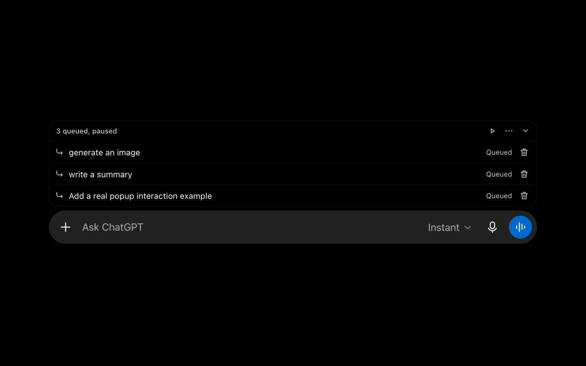
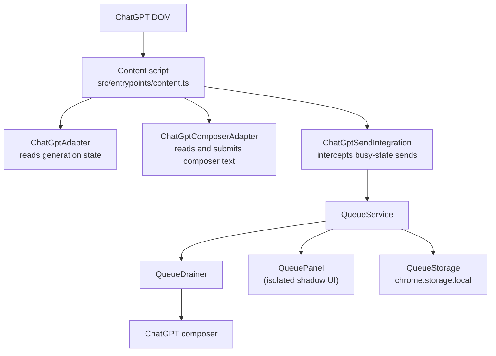
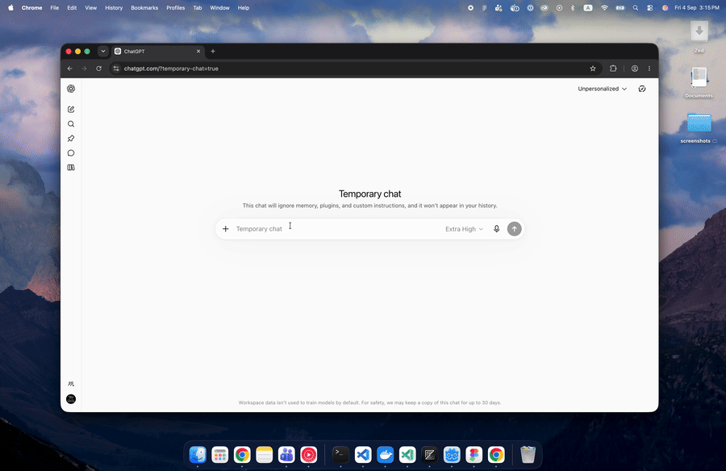

<div align="center">
  
  <h1>ChatGPT Message Queue</h1>
  <p><strong>Queue the next steps while ChatGPT is still working.</strong> Keep writing while ChatGPT is generating. Messages wait in a local FIFO queue and send automatically when ChatGPT is ready.</p>
  <p>
    <a href="https://github.com/technway/chatgpt-message-queue/actions/workflows/validation.yml"></a>
    <a href="https://github.com/technway/chatgpt-message-queue/stargazers"></a>
    
    
    
  </p>
</div>



⭐ Find this useful? Star the repo to help more ChatGPT users discover the queue :)

## What it solves

ChatGPT normally accepts one message while a response is generating. This extension lets you submit follow-up messages without waiting. It displays the pending messages beside the composer and sends them one at a time as each response finishes.

## How queueing works

1. A normal message is sent through ChatGPT unchanged.
2. If ChatGPT is generating, its send button is unavailable, or unfinished queue work exists, the extension captures the message and adds it to the current conversation's FIFO queue.
3. When ChatGPT becomes available, the queue drainer places the next message in the composer and submits it.
4. Pending messages can be moved up or down before they are sent.
5. Queued messages can be edited in place; automatic sending pauses at the edited message while earlier messages continue.
6. Queue state and UI preferences are stored locally per conversation. After a reload, pending work is restored paused so it can be explicitly resumed.

The extension does not send messages to its own service: it operates on the ChatGPT page already open in the browser.



The ChatGPT adapter is the only layer that knows ChatGPT's DOM selectors. Queue behavior is covered independently by unit tests and end-to-end tests against a local fake page.

## Demo



## Installation

### From the Chrome Web Store

The store listing will be linked here after the first public release.

### From a local build

You need Node.js and pnpm. Use the Node.js version in `.nvmrc` and pnpm 10.

```bash
git clone https://github.com/technway/chatgpt-message-queue.git
cd chatgpt-message-queue
pnpm install
pnpm build
```

Open `chrome://extensions`, enable **Developer mode**, choose **Load unpacked**, and select `.output/chrome-mv3`.

## Development

Start a development build with:

```bash
pnpm dev
```

The development extension is generated in `.output/chrome-mv3-dev`. Edit source files under `src/`; WXT rebuilds the extension during development.

Available commands:

```text
pnpm dev              Start the Chrome development build
pnpm dev:firefox      Start the Firefox development build
pnpm build            Build the Chrome extension
pnpm build:firefox    Build the Firefox extension
pnpm test             Run unit tests
pnpm test:e2e         Build the extension and run browser E2E tests
pnpm check            Run Biome checks
pnpm format           Format files with Biome
pnpm compile          Type-check without emitting files
pnpm zip              Create the Chrome Web Store ZIP
pnpm zip:firefox      Create a Firefox distribution archive
```

For browser tests, install Playwright Chromium once:

```bash
pnpm exec playwright install chromium
pnpm test:e2e
```

The E2E suite loads the built extension into Chromium and serves `e2e/fake-chatgpt.html` at a ChatGPT URL. It never connects to production ChatGPT.

## Privacy and permissions

- Messages are used only for local queue management and are not sent to a ChatGPT Message Queue backend.
- No backend, analytics, telemetry, account service, or remote database is required.
- No user data is collected by this extension.
- Queued messages and queue preferences are stored in the browser's local extension storage, scoped to the conversation where they were queued.
- The `storage` permission is used to persist queued messages and preferences across page reloads.
- Content-script access is limited to `chatgpt.com` and `chat.openai.com` so the extension can read the composer state, intercept busy-state sends, inject the queue UI, and submit queued text.
- The extension requests no tabs, scripting, identity, downloads, or network permissions, and the background service worker does not process user data.

See the full statement in [PRIVACY.md](./PRIVACY.md).

## Contributing

Please read [CONTRIBUTING.md](./CONTRIBUTING.md) before opening a pull request. The short version is: open or find an issue, keep ChatGPT DOM knowledge inside the adapter, add tests for behavior changes, and run the local quality checks before submitting.

## Release

The release checklist and Chrome Web Store upload flow are documented in [docs/RELEASING.md](./docs/RELEASING.md). The local release artifact is produced with:

```bash
pnpm zip
```

GitHub Actions runs quality checks, unit tests, browser E2E tests, and the extension build for pushes to `main` and pull requests targeting `main`.
